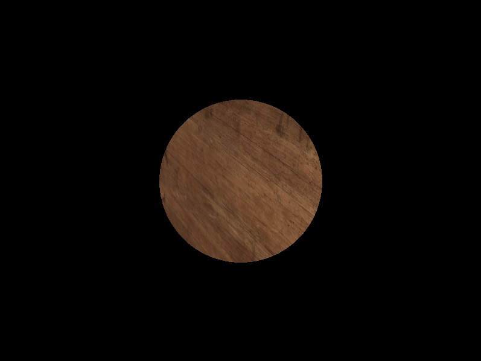
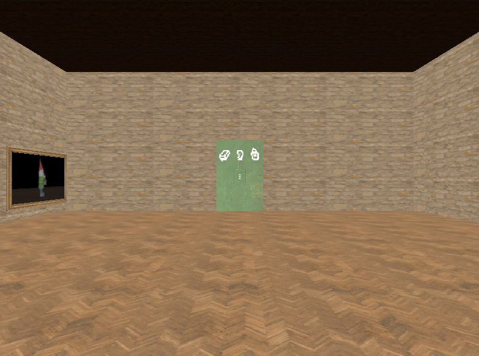

# FOGE FOGE

Trabalho final de Fundamentos de Computação Gráfica (2023/1)

O jogo desenvolvido se chama *FOGE FOGE*. 

O objetivo do jogo é descobrir o número em cada um dos 3 puzzles, a fim de desbloquear a porta que está trancada com um cadeado.

## Contribuições da dupla
**José**
- Classe de animação - curvas de beziér, rotações e translações (utilizadas para transformações geométricas controladas pelo usuário) 
- Sala principal
- Classe de gameobject
- Classe de material
- Classe de textura
- Classe de puzzle
- Puzzle do busto
- Puzzle do cadeado
- Cutscene final
- Interpolação de Phong e Gouraud
- Mapeamento de texturas

**Vítor**
- Testes de colisões
- Mapeamento de texturas
- Puzzle do gnomo
- Puzzle da caixa de madeira
- Classe da fonte de luz
- Modelos de iluminação de Lambert, Phong e Blinn-Phong
- Classe de uma sala
- Classe da câmera - livre e look-at 

## Descrição do processo de desenvolvimento

**Malhas poligonais complexas** - todos os objetos foram construídos utilizando malhas de triângulos, da mesma maneira feita nos laboratórios.

**Transformações geométricas controladas pelos usuários** - no puzzle do gnomo e no puzzle do Busto, o usuário consegue controlar quando ele quer que o gnomo ou o puzzle pulem. Ademais, para abrir o cadeado, o usuário precisa clicar na tela para selecionar cada um dos números.

**Câmera livre e look-at** - a câmera livre está no lobby principal, em que ela tem o seu vetor view fixo e é controlada pelo teclado. A câmera look-at está presente nos puzzles. 

**Múltiplas instâncias de objetos** - no puzzle do gnomo, ele é copiado múltiplas vezes com diferentes posições.

**Testes de intersecções:**
- Cubo-cubo: puzzle do Busto, colisão entre a bola e o busto.
- Plano-plano: puzzle do Gnomo, colisão entre o gnomo que o jogador controla e os gnomos que ele precisa pular sobre.
- Ponto-plano: abrir cadeado da porta, colisão entre o cursor do mouse e os *rings* do cadeado utilizados para selecionar o número.
  
**Modelo de iluminação difusa** - os objetos por padrão possuem iluminação difusa de Lambert. Um exemplo disso são os objetos da sala principal (chão, quadros, paredes, etc.).

**Modelo de iluminação de Blinn-Phong** - os gnomos no puzzle do gnomo possuem iluminação de Blinn-Phong.

**Mapeamento de texturas em todos os objetos** - as texturas são mapeadas a partir de arquivos*.mtl* definidos para cada objeto.

**Movimentação com curva Bézier cubica** - no puzzle do gnomo e no puzzle do busto, tanto o gnomo quanto o busto pulam utilizando curvas Bézier.

**Animações baseadas no tempo** - no puzzle do gnomo e no puzzle do busto, tanto o gnomo quanto o busto se movem utilizando animações baseadas no tempo.

## Funcionamento da aplicação

## Manual descrevendo atalhos
S - retorna para o lobby principal quando está dentro de um puzzle

### Lobby principal
W - move para a frente, e entra nos puzzles quando está na frente do quadro correspondente

A, D - rotaciona para a esquerda e para a direita a câmera

Scroll up e down - faz o scroll para cima e para baixo com a câmera (movimentação de pescoço)

### Puzzle da caixa
Botão esquerdo do mouse (segurar) - rotaciona a câmera ao redor da caixa

### Puzzle do gnomo
Seta para a cima - pula

### Puzzle do busto
W - pula para o tile que o busto está com a frente virada.

### Porta final
Botão esquerdo do mouse (clique) - seleciona o *ring* para colocar o número

Seta esquerda e direita - quando um ring está selecionado, muda para o número da esquerda e da direita, respectivamente. 

## Compilação da aplicação
É necessário baixar o CMake para rodar a aplicação. Após baixar o software, somente é necessário clicar Shift+F5 no VS code.
